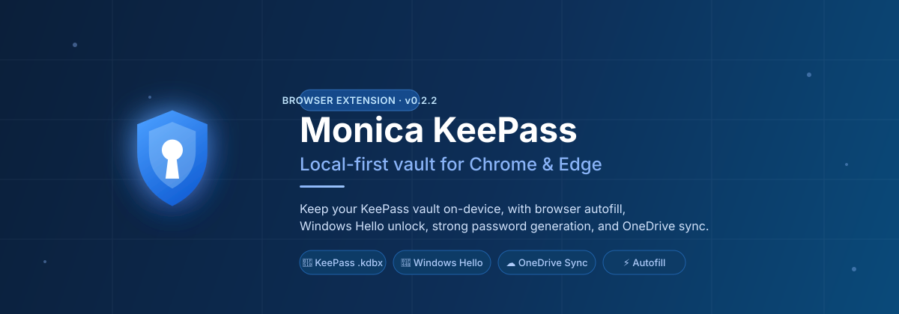
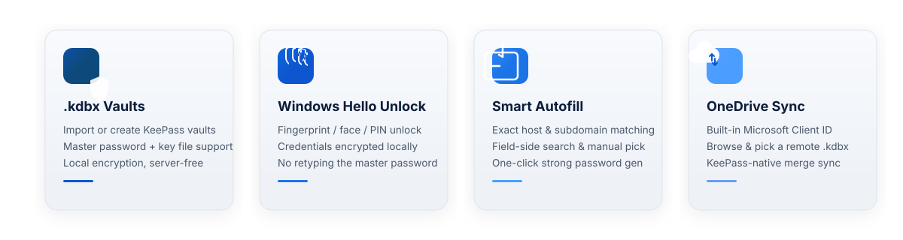

<div align="center">

[](https://tongjibridge.github.io/monica-keepass-extension-reference/)

[中文](README.md) | **English**

[](package.json)
[](LICENSE)
[![Zread Docs](https://img.shields.io/badge/Ask_Zread-docs-00b0aa?style=flat-square&labelColor=000000&logo=data%3Aimage%2Fsvg%2Bxml%3Bbase64%2CPHN2ZyB3aWR0aD0iMTYiIGhlaWdodD0iMTYiIHZpZXdCb3g9IjAgMCAxNiAxNiIgZmlsbD0ibm9uZSIgeG1sbnM9Imh0dHA6Ly93d3cudzMub3JnLzIwMDAvc3ZnIj4KPHBhdGggZD0iTTQuOTYxNTYgMS42MDAxSDIuMjQxNTZDMS44ODgxIDEuNjAwMSAxLjYwMTU2IDEuODg2NjQgMS42MDE1NiAyLjI0MDFWNC45NjAxQzEuNjAxNTYgNS4zMTM1NiAxLjg4ODEgNS42MDAxIDIuMjQxNTYgNS42MDAxSDQuOTYxNTZDNS4zMTUwMiA1LjYwMDEgNS42MDE1NiA1LjMxMzU2IDUuNjAxNTYgNC45NjAxVjIuMjQwMUM1LjYwMTU2IDEuODg2NjQgNS4zMTUwMiAxLjYwMDEgNC45NjE1NiAxLjYwMDFaIiBmaWxsPSIjZmZmIi8%2BCjxwYXRoIGQ9Ik00Ljk2MTU2IDEwLjM5OTlIMi4yNDE1NkMxLjg4ODEgMTAuMzk5OSAxLjYwMTU2IDEwLjY4NjQgMS42MDE1NiAxMS4wMzk5VjEzLjc1OTlDMS42MDE1NiAxNC4xMTM0IDEuODg4MSAxNC4zOTk5IDIuMjQxNTYgMTQuMzk5OUg0Ljk2MTU2QzUuMzE1MDIgMTQuMzk5OSA1LjYwMTU2IDE0LjExMzQgNS42MDE1NiAxMy43NTk5VjExLjAzOTlDNS42MDE1NiAxMC42ODY0IDUuMzE1MDIgMTAuMzk5OSA0Ljk2MTU2IDEwLjM5OTlaIiBmaWxsPSIjZmZmIi8%2BCjxwYXRoIGQ9Ik0xMy43NTg0IDEuNjAwMUgxMS4wMzg0QzEwLjY4NSAxLjYwMDEgMTAuMzk4NCAxLjg4NjY0IDEwLjM5ODQgMi4yNDAxVjQuOTYwMUMxMC4zOTg0IDUuMzEzNTYgMTAuNjg1IDUuNjAwMSAxMS4wMzg0IDUuNjAwMUgxMy43NTg0QzE0LjExMTkgNS42MDAxIDE0LjM5ODQgNS4zMTM1NiAxNC4zOTg0IDQuOTYwMVYyLjI0MDFDMTQuMzk4NCAxLjg4NjY0IDE0LjExMTkgMS42MDAxIDEzLjc1ODQgMS42MDAxWiIgZmlsbD0iI2ZmZiIvPgo8cGF0aCBkPSJNNCAxMkwxMiA0TDQgMTJaIiBmaWxsPSIjZmZmIi8%2BCjxwYXRoIGQ9Ik00IDEyTDEyIDQiIHN0cm9rZT0iI2ZmZiIgc3Ryb2tlLXdpZHRoPSIxLjUiIHN0cm9rZS1saW5lY2FwPSJyb3VuZCIvPgo8L3N2Zz4K&logoColor=ffffff)](https://zread.ai/tongjibridge/monica-keepass-extension-reference)
[](https://tongjibridge.github.io/monica-keepass-extension-reference/)

</div>

## ✨ Feature Overview



Monica KeePass is a **local-first** browser extension for Chrome and Edge that works with KeePass `.kdbx` vaults. It keeps your encrypted vault on the device while adding browser autofill, Windows Hello unlock, strong password generation, and OneDrive backup/sync.

## 🚀 Quick Start

### Install for Development

```powershell
pnpm install
pnpm run build
```

Then open `chrome://extensions/`, enable Developer mode, and load the unpacked extension:

```text
extension/.output/chrome-mv3
```

### Common Scripts

```powershell
pnpm run compile      # Type-check
pnpm run test:harness # Run tests
pnpm run build        # Build extension
pnpm run zip          # Package as zip
pnpm run crx          # Package as crx
```

## 🔐 Core Capabilities

### KeePass Vaults

- Import or create KeePass-compatible `.kdbx` vaults
- Unlock with a master password, key file, or a remembered key file
- All data stays encrypted on your device — nothing is sent to any server

### Windows Hello Unlock

- Optional Windows Hello unlock (fingerprint / face / PIN)
- Credentials are encrypted locally with DPAPI
- Skip retyping your master password every time

### Smart Autofill

- Android-style URL matching: exact host, parent/child subdomains, same base domain
- Field-side controls for manual account search and fill
- Strong password generator button next to password fields

## ☁️ OneDrive Sync

The extension uses `chrome.identity.launchWebAuthFlow` with Microsoft Identity and Graph `Files.ReadWrite` access to read and write `.kdbx` files in OneDrive.

**Built-in Microsoft Client ID:**

```text
2113bcce-ee99-4703-b234-55fe2b3932da
```

The matching Microsoft app registration must include the extension redirect URI:

```text
https://<extension-id>.chromiumapp.org/onedrive
```

> The current redirect URI is shown in the OneDrive section of the extension settings page. After connecting, choose a `.kdbx` file from OneDrive to initialize the local vault.

**Sync features:**

- Connect to OneDrive directly from the settings page
- Browse OneDrive folders and select a `.kdbx` to initialize
- Pull remote updates, push local changes, or sync with KeePass-native merge
- Uses ETag/cTag from Graph file metadata to detect remote changes and avoid blind overwrites

## 🔧 GitHub Actions Packaging

The repository ships with `.github/workflows/build-extension.yml`.

| Trigger | Artifacts |
| --- | --- |
| push to `main` / Pull Request | type-check + tests + `.zip` + test `.crx` |
| Version tag (e.g. `v0.1.0`) | GitHub Release + `.zip` + stable `.crx` |

The zipped and CRX extension packages are uploaded as a workflow artifact named `monica-keepass-extension-chrome`.

### Stable CRX Releases

Add a repository secret named `CRX_PRIVATE_KEY_BASE64`. It must contain the base64-encoded PEM private key used to sign the CRX.

> Without this secret, normal branch builds still create a test CRX with a temporary key, but tagged releases fail — preventing the publication of an extension with a changing ID.

Generate a private key and print the secret value:

```powershell
openssl genrsa -out crx-private-key.pem 2048
[Convert]::ToBase64String([IO.File]::ReadAllBytes("crx-private-key.pem"))
```

Publish a release:

```powershell
git tag v0.1.0
git push origin v0.1.0
```

## 📝 Notes

This repository is a browser-extension reference build. The Android app and the browser extension do not share runtime storage, but the OneDrive KeePass sync flow follows the Android-side design: Graph file metadata is checked with ETag or cTag, local state keeps a base hash, and conflict cases avoid overwriting the remote vault blindly.

## 📄 License

This project is released under the **GNU General Public License v3.0 only** (`GPL-3.0-only`), matching the license used by the Monica Android reference project. See [LICENSE](LICENSE) for the full text.

## 🙏 Acknowledgements

Thanks to the Monica Android project for the reference implementation and product direction:

- **Monica for Android** — [JoyinJoester/Monica](https://github.com/JoyinJoester/Monica)

This extension also builds on the KeePass ecosystem and `kdbxweb` for `.kdbx` read/write and merge support.

This project uses open-source libraries including `kdbxweb`, `hash-wasm`, React, Mantine, Tabler Icons, `tldts`, WXT, esbuild, and TypeScript. See [THIRD_PARTY_NOTICES.md](THIRD_PARTY_NOTICES.md) for details.

---

<div align="center">


</div>
