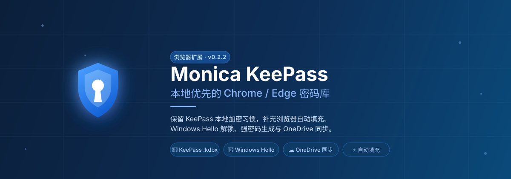
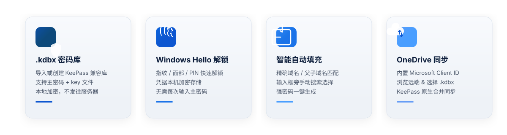

<div align="center">

[](https://tongjibridge.github.io/monica-keepass-extension-reference/)

**中文** | [English](README-en.md)

[](package.json)
[](LICENSE)
[![Zread 文档](https://img.shields.io/badge/Ask_Zread-docs-00b0aa?style=flat-square&labelColor=000000&logo=data%3Aimage%2Fsvg%2Bxml%3Bbase64%2CPHN2ZyB3aWR0aD0iMTYiIGhlaWdodD0iMTYiIHZpZXdCb3g9IjAgMCAxNiAxNiIgZmlsbD0ibm9uZSIgeG1sbnM9Imh0dHA6Ly93d3cudzMub3JnLzIwMDAvc3ZnIj4KPHBhdGggZD0iTTQuOTYxNTYgMS42MDAxSDIuMjQxNTZDMS44ODgxIDEuNjAwMSAxLjYwMTU2IDEuODg2NjQgMS42MDE1NiAyLjI0MDFWNC45NjAxQzEuNjAxNTYgNS4zMTM1NiAxLjg4ODEgNS42MDAxIDIuMjQxNTYgNS42MDAxSDQuOTYxNTZDNS4zMTUwMiA1LjYwMDEgNS42MDE1NiA1LjMxMzU2IDUuNjAxNTYgNC45NjAxVjIuMjQwMUM1LjYwMTU2IDEuODg2NjQgNS4zMTUwMiAxLjYwMDEgNC45NjE1NiAxLjYwMDFaIiBmaWxsPSIjZmZmIi8%2BCjxwYXRoIGQ9Ik00Ljk2MTU2IDEwLjM5OTlIMi4yNDE1NkMxLjg4ODEgMTAuMzk5OSAxLjYwMTU2IDEwLjY4NjQgMS42MDE1NiAxMS4wMzk5VjEzLjc1OTlDMS42MDE1NiAxNC4xMTM0IDEuODg4MSAxNC4zOTk5IDIuMjQxNTYgMTQuMzk5OUg0Ljk2MTU2QzUuMzE1MDIgMTQuMzk5OSA1LjYwMTU2IDE0LjExMzQgNS42MDE1NiAxMy43NTk5VjExLjAzOTlDNS42MDE1NiAxMC42ODY0IDUuMzE1MDIgMTAuMzk5OSA0Ljk2MTU2IDEwLjM5OTlaIiBmaWxsPSIjZmZmIi8%2BCjxwYXRoIGQ9Ik0xMy43NTg0IDEuNjAwMUgxMS4wMzg0QzEwLjY4NSAxLjYwMDEgMTAuMzk4NCAxLjg4NjY0IDEwLjM5ODQgMi4yNDAxVjQuOTYwMUMxMC4zOTg0IDUuMzEzNTYgMTAuNjg1IDUuNjAwMSAxMS4wMzg0IDUuNjAwMUgxMy43NTg0QzE0LjExMTkgNS42MDAxIDE0LjM5ODQgNS4zMTM1NiAxNC4zOTg0IDQuOTYwMVYyLjI0MDFDMTQuMzk4NCAxLjg4NjY0IDE0LjExMTkgMS42MDAxIDEzLjc1ODQgMS42MDAxWiIgZmlsbD0iI2ZmZiIvPgo8cGF0aCBkPSJNNCAxMkwxMiA0TDQgMTJaIiBmaWxsPSIjZmZmIi8%2BCjxwYXRoIGQ9Ik00IDEyTDEyIDQiIHN0cm9rZT0iI2ZmZiIgc3Ryb2tlLXdpZHRoPSIxLjUiIHN0cm9rZS1saW5lY2FwPSJyb3VuZCIvPgo8L3N2Zz4K&logoColor=ffffff)](https://zread.ai/tongjibridge/monica-keepass-extension-reference)
[](https://tongjibridge.github.io/monica-keepass-extension-reference/)

</div>

## ✨ 功能概览



Monica KeePass 是一个**本地优先**的 Chrome / Edge 浏览器插件，用于管理 KeePass `.kdbx` 密码库。它保留了 KeePass 本地加密文件的使用方式，同时补充浏览器自动填充、Windows Hello 解锁、强密码生成和 OneDrive 备份/同步。

## 🚀 快速开始

### 开发安装

```powershell
pnpm install
pnpm run build
```

然后打开 `chrome://extensions/`，启用开发者模式，加载已解压的扩展：

```text
extension/.output/chrome-mv3
```

### 常用命令

```powershell
pnpm run compile      # 类型检查
pnpm run test:harness # 运行测试
pnpm run build        # 构建扩展
pnpm run zip          # 打包为 zip
pnpm run crx          # 打包为 crx
```

## 🔐 核心能力

### KeePass 密码库

- 导入或创建 KeePass 兼容的 `.kdbx` 密码库
- 支持主密码、key 文件，以及本机记住 key 文件
- 所有数据本地加密存储，不发往任何服务器

### Windows Hello 解锁

- 可选 Windows Hello 解锁（指纹 / 面部 / PIN）
- 凭据只在本机通过 DPAPI 加密保存
- 跳过每次输入主密码的繁琐

### 智能自动填充

- 更接近安卓端的 URL 匹配策略：精确域名、父子域名、同主域名
- 网页输入框旁增加手动搜索 / 选择账号填充按钮
- 密码输入框旁增加强密码生成按钮

## ☁️ OneDrive 同步

插件使用 `chrome.identity.launchWebAuthFlow` 接入 Microsoft Identity，并通过 Graph `Files.ReadWrite` 权限读写 OneDrive 中的 `.kdbx` 文件。

**已内置 Microsoft Client ID：**

```text
2113bcce-ee99-4703-b234-55fe2b3932da
```

对应的 Microsoft 应用注册需要配置插件重定向地址：

```text
https://<extension-id>.chromiumapp.org/onedrive
```

> 当前重定向地址会显示在插件设置页的 OneDrive 区域。连接后，选择 OneDrive 里的 `.kdbx` 文件即可初始化本地密码库。

**同步特性：**

- 设置页可直接连接 OneDrive
- 可浏览 OneDrive 文件夹并选择 `.kdbx` 初始化
- 支持拉取远端、上传本地，以及基于 KeePass 原生 merge 的同步
- 通过 Graph 文件元数据中的 ETag/cTag 判断远端变化，避免盲目覆盖

## 🔧 GitHub Actions 自动打包

仓库内置 `.github/workflows/build-extension.yml`。

| 触发条件 | 构建产物 |
| --- | --- |
| push 到 `main` / Pull Request | 类型检查 + 测试 + `.zip` + 测试版 `.crx` |
| 推送 `v0.1.0` 等版本 tag | GitHub Release + `.zip` + 稳定版 `.crx` |

打包后的 `.zip` 和 `.crx` 会作为 workflow artifact 上传，名称为 `monica-keepass-extension-chrome`。

### 发布稳定 CRX

在 GitHub 仓库设置里添加 secret：`CRX_PRIVATE_KEY_BASE64`。它是 CRX 签名私钥 PEM 文件的 base64 内容。

> 没有这个 secret 时，普通分支构建仍会用临时私钥生成测试 CRX，但 tag release 会失败——避免发布扩展 ID 会变化的 CRX。

生成私钥并输出 secret 值：

```powershell
openssl genrsa -out crx-private-key.pem 2048
[Convert]::ToBase64String([IO.File]::ReadAllBytes("crx-private-key.pem"))
```

发布一个版本：

```powershell
git tag v0.1.0
git push origin v0.1.0
```

## 📝 说明

这是浏览器插件参考版本。安卓端和浏览器插件不共享运行时存储，但 OneDrive KeePass 同步流程参考了安卓端实现：通过 Graph 文件元数据中的 ETag/cTag 判断远端变化，本地保存 base hash，并在冲突场景下避免盲目覆盖远端密码库。

## 📄 开源协议

本项目使用 **GNU General Public License v3.0 only**（`GPL-3.0-only`），与 Monica 安卓参考项目保持一致。完整文本见 [LICENSE](LICENSE)。

## 🙏 致谢

感谢 Monica 安卓项目提供参考实现与产品方向：

- **Monica for Android** — [JoyinJoester/Monica](https://github.com/JoyinJoester/Monica)

本插件同时基于 KeePass 生态和 `kdbxweb`，用于 `.kdbx` 的读写与合并。

本项目使用了 `kdbxweb`、`hash-wasm`、React、Mantine、Tabler Icons、`tldts`、WXT、esbuild、TypeScript 等开源项目。详情见 [THIRD_PARTY_NOTICES.md](THIRD_PARTY_NOTICES.md)。

---

<div align="center">


</div>
